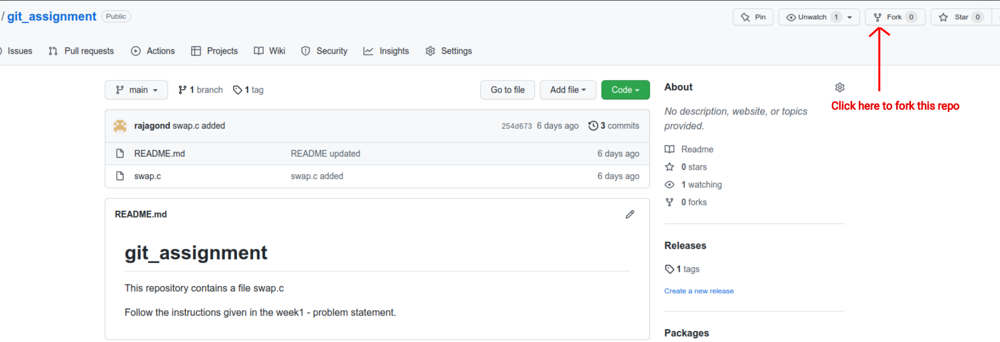
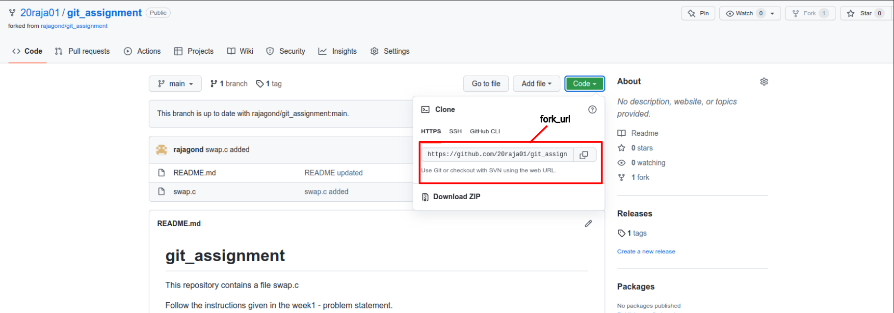

### Exercises

1. **Repository Creation**

    A. 
    
    - Clone [bootcamp2022](https://github.com/cserl-iitb/bootcamp2022) repo(use `git clone https://github.com/cserl-iitb/bootcamp2022.git` command).

    B.

    - Create a new private repository named **\<Bootcamp_2022_my_submission\>** (or any other similar name) from your account. 

    - Clone it on your local machine (use git clone \<url\> command).
  
    - Make a new folder named \<Week1_solutions\> inside it. 

    - copy files from **bootcamp2022/week1_warmup** directory to the \<Week1_solutions\> directory.

    - Do add, commit and push on your repository.
    
    - Push your solutions onto your repo periodically.
  
  Ans=>
     
   

2. **Do you want to fix a bug?**

    - Fork [this](https://github.com/rajagond/git_assignment) repository. This will create a copy of repository on your account.  

    

    
    

    - Clone the repository you just created using fork from your github account onto your local machine (use git clone \<fork_url\> command).  

    

    
    

  
    - <code>cd git_assignment</code>

    - <code>git checkout -b \<new_branch\></code> ( **-b** flag tells Git to run <code>git branch \<new_branch\></code> before running <code>git checkout \<new_branch\></code>.)

    - Fix bug (test it) and add gitignore file to tells git to ignore a.out file.

    - <code>git add .</code>

    - <code>git commit -m "bug fixed"</code>

    - <code>git push -u origin \<new_branch\></code>

    - Now merge the \<new_branch\> into main by following below four commands:  
        <code>git checkout main</code>

        <code>git pull origin main</code>
        
        <code>git merge \<new_branch\></code>

        <code>git push -u origin main</code>

    - <code>git tag</code> (This command will print <code>submission</code> on terminal. Lookup online to know more about what <code>git tag</code> does.) Note that it prints <code>submission</code> because the <code>submission</code> tag was already created in the original repository.

    - Now, delete the <code>submission</code> tag from both local and remote repo.  
        <code>git tag -d submission</code>(delete local tags)

        <code>git push origin :refs/tags/submission</code>(push changes to remote repo)

        Alternative approach to delete remote and local tags  
        <code>git push --delete origin submission</code>

        <code>git tag -d submission</code>
        
    - Create a new tag <code>final_submission</code> and push it on your repository.

   
